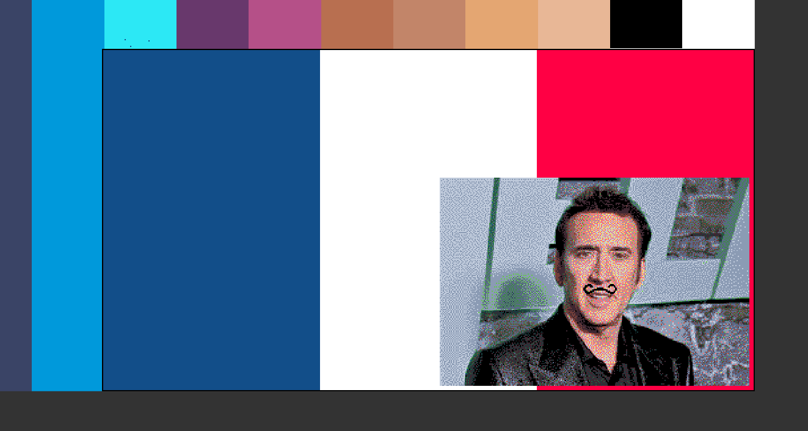

# AddAPixelWriter
This program allows drawing images to the https://addapixel.fly.dev/ website. 

I used this program to draw pixel art images to this cooperative pixel art project.I converted these regular jpegs images to the correct format by mapping the projects colors id's to hexcodes and creating a lookup table. I then used photoshop to map the colors of to only the one's used in the pallete on the website. I then created a 2d np array of the color id's the websites api used and then used this program to draw the image to the website. All of the threading stuff in main is to increase output and increase the resillience to disonnection. The website websocket could get easily overwhelmed with requests, so I had to limit the number of requests per websocket.

Under the hood the program tries its best to maintain its connection to the websocket and continue writing the image.

Here are some examples of images I drew using this program:




## Setup
Create virtual environment and download deps w:
```
python -m venv .venv && source .venv/bin/activate && pip install -r requirements.txt
```

## Run
An example image of what's needed is in `assets/hasselhof.png`

Put an image in the repository and run w/
```
python -m src --image <image_path> --start-x 0 --start-y 0 --threads 4 --sleep-per-px 0.01 --sleep-per-row 0.1
```

Here's an example command:
```python -m src --image assets/hasselhof.png --start-x 0 --start-y 0 --threads 4 --sleep-per-px 0.01 --sleep-per-row 1```

The image MUST map to the color pallete used by the website. There's a function in the lib to grab that color pallete and convert the image to a 2d array of color id's.